# Siftbox

  [](https://github.com/nulljosh/siftbox)

An inbox fills up whether you look at it or not. Dev-tool alerts that actually need a fix. Newsletters you never asked twice for. Notification spam wearing a real sender's name. Sorting it by hand is the same ten minutes every day, spent the same way.

That's the gap.



## What it does

Sign in with Google and Siftbox reads your actual inbox over the Gmail API — web, iOS, or macOS. Junk gets scored — sender/domain mismatch, urgency language, an unsubscribe header nobody asked for — and cleared with one tap: a real `List-Unsubscribe` one-click POST where the sender supports it, archive or delete otherwise. Nothing is touched until you tap it.

The Claude Code side (`/mail`) still exists for the dev-tool-alert half of the job — matching an App Store Connect or GitHub Actions email to the right project and fixing or filing it — since that needs a coding agent, not a mail client. The two share the same spam-scoring rules.

## Why this and not a filter rule

A filter rule is static — it catches what you already know to catch. This reads the actual message, decides what kind of thing it is, and takes the next real step: unsubscribe and move on, or (via `/mail`) file a bug or fix a build. The difference between a spam folder and someone who actually reads your mail.

## Run it

Open [siftbox.heyitsmejosh.com](https://siftbox.heyitsmejosh.com) (or the iOS/macOS app), connect Gmail, triage. For the dev-tool-alert side, from a Claude Code session:

```
/mail                 dry run — read, classify, report, touch nothing
/mail apply            real pass — file, fix, archive/delete, unsubscribe
```

Full triage logic, spam scoring, and unsubscribe handling: [SKILL.md](SKILL.md).

## Screenshots

  

## Architecture


